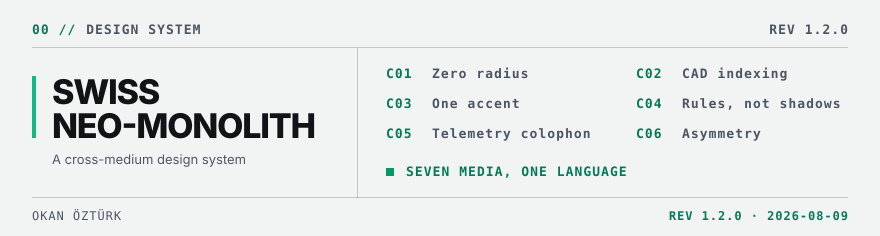
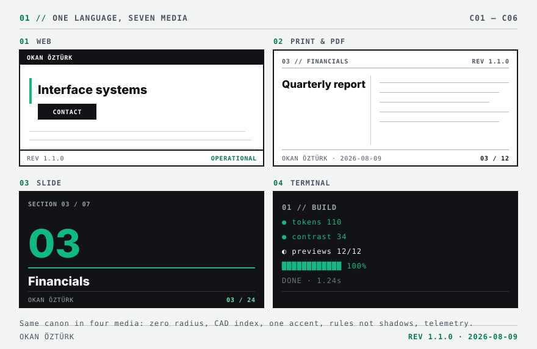
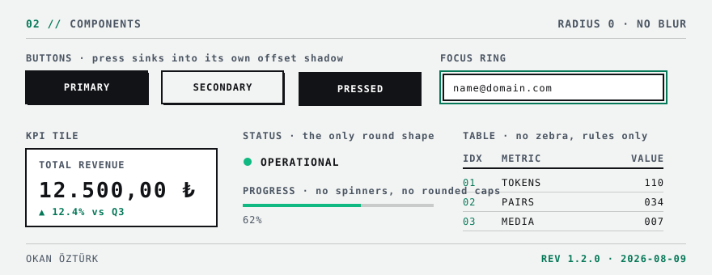
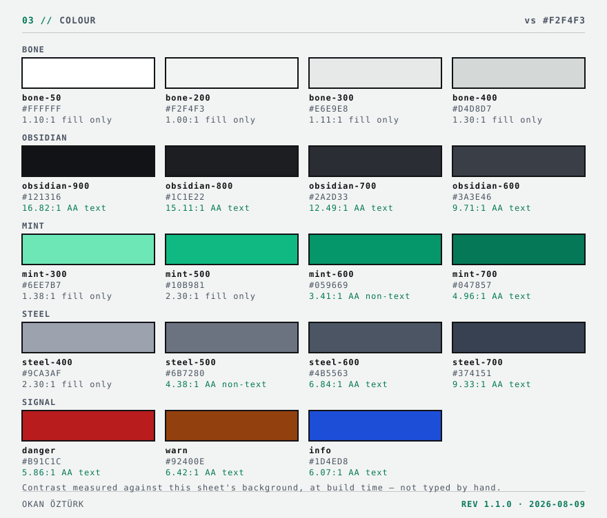
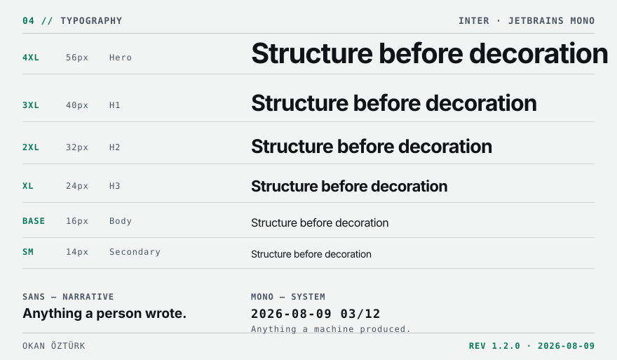

<picture>
  <source media="(prefers-color-scheme: dark)" srcset="preview/banner-dark.svg">
  
</picture>

**One design language across every medium.** Swiss editorial typography,
industrial CAD schematics, zero radius. A web component, a printed proposal and a
terminal report read as the work of one hand — because they follow the same six
rules and the same tokens.

It ships as a **Claude skill**, so on any machine where it is installed the system
gets applied automatically, whatever you are building.

[](https://github.com/joxinyks/swiss-neo-monolith/actions/workflows/verify.yml)


---

## 01 // QUICKSTART

```bash
git clone https://github.com/joxinyks/swiss-neo-monolith.git
cd swiss-neo-monolith
```

**Windows**

```powershell
.\install.ps1
```

**macOS · Linux**

```bash
chmod +x install.sh && ./install.sh
```

Restart Claude. That is the whole setup — the installer links the repository into
`~/.claude/skills/`, compiles the token bindings and runs the contrast gate.

<details>
<summary><b>Other install modes</b></summary>

<br>

On the machine where you edit the system, link instead of copying so changes take
effect without reinstalling:

```powershell
.\install.ps1 -Link
```

```bash
./install.sh --link
```

Update an existing installation:

```bash
git pull && .\install.ps1 -Force
```

Verify at any time:

```bash
npm run verify
```

This rebuilds every binding and runs both gates — contrast and canon. Anything
other than `PASS` means the installation is incomplete or broken.

</details>

---

## 02 // SEE IT

The same canon rendered as a web page, a print page, a slide and a terminal.
Every image in this README is **generated from the tokens** — change a token,
rerun `npm run build`, and the showcase follows. It cannot drift from the system
it documents.

<picture>
  <source media="(prefers-color-scheme: dark)" srcset="preview/media-dark.svg">
  
</picture>

<details>
<summary><b>Components</b> — zero radius, hard-offset shadows, the tactile press state</summary>

<br>

<picture>
  <source media="(prefers-color-scheme: dark)" srcset="preview/components-dark.svg">
  
</picture>

</details>

<details>
<summary><b>Colour</b> — every swatch states its own measured contrast ratio</summary>

<br>

<picture>
  <source media="(prefers-color-scheme: dark)" srcset="preview/palette-dark.svg">
  
</picture>

</details>

<details>
<summary><b>Typography</b> — two families, one hard rule</summary>

<br>

<picture>
  <source media="(prefers-color-scheme: dark)" srcset="preview/type-dark.svg">
  
</picture>

Anything a machine produced is monospace; anything a person wrote is sans.

</details>

---

## 03 // THE CANON

Six invariants, independent of medium. Whether an output belongs to this system is
decided here.

| | Rule |
|---|---|
| `C01` | **Zero radius.** No rounded corners; the only exception is the status pulse dot. |
| `C02` | **CAD indexing.** Every section opens with a two-digit monospace tag: `01 // SECTION`. |
| `C03` | **One chromatic accent.** No colour but mint; mint stays under 10% of visible area. |
| `C04` | **Rules, not shadows.** Crisp rules instead of blur, gradients and texture. |
| `C05` | **Telemetry colophon.** Every output carries revision, ISO date and status. |
| `C06` | **Asymmetry.** A 40/60 split by default; nothing is centred. |

Full detail and the red lines: **[`SKILL.md`](SKILL.md)**

---

## 04 // DOCS

| Medium | |
|---|---|
| Web — React, Tailwind, HTML | [`10-web.md`](references/10-web.md) |
| Applications — desktop, mobile | [`11-app.md`](references/11-app.md) |
| Print and PDF | [`12-print.md`](references/12-print.md) |
| Office — PPTX, DOCX, XLSX | [`13-office.md`](references/13-office.md) |
| Terminal and CLI | [`14-terminal.md`](references/14-terminal.md) |
| Data visualisation | [`15-data-viz.md`](references/15-data-viz.md) |
| Brand assets | [`16-brand-assets.md`](references/16-brand-assets.md) |

Base layer, applying to all of them:
[colour and scale](references/01-foundations.md) ·
[typography](references/02-typography.md) ·
[motion and sound](references/03-motion-sound.md) ·
[voice and format](references/04-voice.md) ·
[delivery checklist](references/99-checklist.md)

---

## 05 // TOKENS

`tokens/tokens.json` is the only file edited by hand. Everything else is generated
from it.

```
tokens.json ──▶ tokens.css · tokens.scss · tokens.ts · tailwind.preset.cjs
                tokens.py  · tokens.dart · tokens.resolved.json
                eslint-snm.cjs · package.json    the delivery surface
                preview/*.svg                    the showcase above
                check-contrast · check-canon     the gates, non-zero on failure
```

### Putting them in a project

The system is not published to a registry — it is one personal repository, and a
release process would only add a way for the two to disagree. Instead, copy the
compiled surface into the consuming project:

```bash
npm run vendor -- ../my-app/vendor/snm
```

`tokens/dist/` is self-contained, so that directory is all the project needs.

<details>
<summary><b>Import paths</b> — one directory, every medium</summary>

<br>

**Web — Tailwind**

```js
// tailwind.config.js — the preset replaces the palette, so an off-palette
// colour produces no class and fails at build time.
module.exports = { presets: [require('./vendor/snm/tailwind.preset.cjs')] };
```

```css
/* app.css — before the Tailwind layers */
@import './vendor/snm/tokens.css';
```

**TypeScript — canvas, SVG, email**

```ts
import { token, cssVar } from './vendor/snm/tokens';
ctx.fillStyle = token('bgInverse');
```

**Python — PDF and charts**

```python
from vendor.snm.tokens import token, rgb
fill = rgb("accent")            # (0.06, 0.73, 0.51)
```

**Flutter** — vendor into `lib/`, then import by package path:

```dart
import 'package:my_app/snm/tokens.dart';
Container(color: SnmLight.bgRaised, ...)
```

**Lint** — the rules that make a canon violation fail the build:

```js
// eslint.config.js
module.exports = [ ...require('./vendor/snm/eslint-snm.cjs') ];
```

If you would rather write a bare specifier than a relative path, the vendored
directory is a valid package:

```bash
npm i file:./vendor/snm     # then: import { token } from '@snm/tokens'
```

</details>

<details>
<summary><b>Changing a token</b></summary>

<br>

```bash
# 1  edit tokens/tokens.json, raise $meta.version
npm run verify     # rebuild every binding and the showcase, then both gates
# 2  record the change in CHANGELOG.md
```

The contrast gate holds guard tests over tones banned for text, so a future
palette edit cannot quietly make them look safe. The canon gate refuses a radius,
a blur, a gradient or a hand-written colour anywhere in the source, checks that
the print stylesheet and the Office theme still carry real token values, and
fails if the version disagrees with itself in any of the six places it is stated.
See [`CONTRIBUTING.md`](CONTRIBUTING.md).

</details>

---

## 06 // LAYOUT

```
SKILL.md          the constitution — also the skill entry point
references/       12 medium and base-layer references
tokens/           tokens.json + generated delivery surface in dist/
assets/           web · print · office reference implementations
scripts/          build · preview · vendor · contrast gate · canon gate
preview/          generated showcase — do not edit
install.ps1 .sh   installers
```

The repository root *is* the skill: the installer links it into
`~/.claude/skills/`, so there is no packaged copy to fall out of date.

---

## 07 // LICENCE

The code, the tokens and the documentation are **MIT** — take the pipeline, the
gates, the token compiler, any of it.

What MIT does not grant is an identity. "Swiss Neo-Monolith", "SNM" and this
palette are the signature of one person's work; using them to present output as
mine would be misrepresentation whatever the licence says. Fork the machinery,
change the name and the accent, and it is yours.

---

```
OKAN ÖZTÜRK · joxinyks.com
REV 1.2.0 · STATUS: OPERATIONAL · LICENCE: MIT
```
