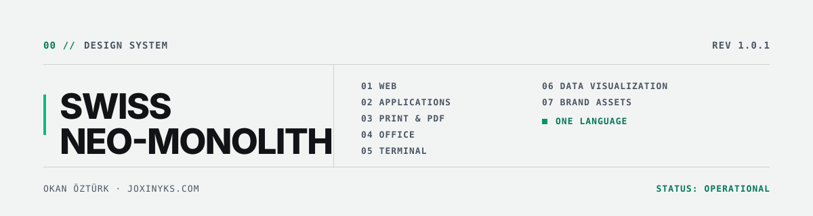

<picture>
  <source media="(prefers-color-scheme: dark)" srcset=".github/banner-dark.svg">
  
</picture>


Tek bir tasarım dili; web arayüzünden basılı teklife, masaüstü uygulamasından
terminal çıktısına kadar. Bir bileşen, bir kapak sayfası ve bir komut satırı
raporu aynı elden çıkmış görünür.

Bu depo iki işlevi birlikte görür:

| | |
|---|---|
| **Tasarım sistemi** | Token'lar, kurallar, referans uygulamalar ve denetim araçları. |
| **Claude skill'i** | Kurulu olduğu makinede Claude bu sistemi kendiliğinden uygular. |

---

## 01 // KURULUM

```bash
git clone https://github.com/joxinyks/swiss-neo-monolith.git
cd swiss-neo-monolith
```

**Windows**

```powershell
.\install.ps1
```

**macOS · Linux**

```bash
chmod +x install.sh && ./install.sh
```

Betik `skills/swiss-neo-monolith` dizinini `~/.claude/skills/` altına yerleştirir,
token'ları derler ve kontrast denetimini çalıştırır. Claude yeniden başlatıldığında
skill her projede etkindir.

### Geliştirme makinesi

Sistemin kendisini düzenlediğin makinede kopya yerine bağlantı kur; değişiklikler
yeniden kurulum gerektirmeden geçerli olur.

```powershell
.\install.ps1 -Link
```

```bash
./install.sh --link
```

### Güncelleme

```bash
git pull && .\install.ps1 -Force
```

### Doğrulama

```bash
npm run verify
```

`PASS` dönmüyorsa kurulum eksik veya bozuktur.

---

## 02 // KANON

Altı değişmez, mecradan bağımsızdır. Bir çıktının bu sisteme ait olup olmadığı
bunlarla belirlenir.

| Kod | Kural |
|---|---|
| `C01` | **Sıfır yarıçap.** Yuvarlatılmış köşe yok; tek istisna durum nabzı. |
| `C02` | **CAD indeksleme.** Her bölüm iki haneli monospace etiketle açılır: `01 // SECTION`. |
| `C03` | **Tek kromatik aksan.** Mint dışında renk yok; mint görünür alanın %10'unu aşmaz. |
| `C04` | **Yapı çizgiyle kurulur.** Bulanık gölge, degrade ve doku yerine keskin kural çizgileri. |
| `C05` | **Telemetri künyesi.** Her çıktı sürüm, ISO tarih ve durum taşır. |
| `C06` | **Asimetri.** Varsayılan 40/60 bölünme; ortalanmış kompozisyon yok. |

Ayrıntılar: [`SKILL.md`](skills/swiss-neo-monolith/SKILL.md)

---

## 03 // KAPSAM

| Mecra | Referans |
|---|---|
| Web — React, Tailwind, HTML | [`10-web.md`](skills/swiss-neo-monolith/references/10-web.md) |
| Uygulama — masaüstü ve mobil | [`11-app.md`](skills/swiss-neo-monolith/references/11-app.md) |
| Baskı ve PDF | [`12-print.md`](skills/swiss-neo-monolith/references/12-print.md) |
| Ofis — PPTX, DOCX, XLSX | [`13-office.md`](skills/swiss-neo-monolith/references/13-office.md) |
| Terminal ve CLI | [`14-terminal.md`](skills/swiss-neo-monolith/references/14-terminal.md) |
| Veri görselleştirme | [`15-data-viz.md`](skills/swiss-neo-monolith/references/15-data-viz.md) |
| Marka varlıkları | [`16-brand-assets.md`](skills/swiss-neo-monolith/references/16-brand-assets.md) |

Temel katman her mecra için geçerlidir: [renk ve ölçek](skills/swiss-neo-monolith/references/01-foundations.md) ·
[tipografi](skills/swiss-neo-monolith/references/02-typography.md) ·
[hareket ve ses](skills/swiss-neo-monolith/references/03-motion-sound.md) ·
[dil ve biçim](skills/swiss-neo-monolith/references/04-voice.md) ·
[teslim denetimi](skills/swiss-neo-monolith/references/99-checklist.md)

---

## 04 // TOKEN BORU HATTI

Elle düzenlenen tek dosya `tokens/tokens.json`'dır. Diğer tüm bağlamalar ondan
üretilir; `dist/` altındaki hiçbir dosya elle değiştirilmez.

```
tokens.json
    │
    └── build-tokens.mjs
            ├── tokens.css              CSS custom properties, açık ve koyu tema
            ├── tokens.scss
            ├── tokens.ts               tip güvenli erişim, literal değerler
            ├── tailwind.preset.cjs     palette dışını derleme zamanında yakalar
            ├── tokens.py               ReportLab · WeasyPrint · matplotlib
            ├── tokens.dart             Flutter
            └── tokens.resolved.json    Office · e-posta · native platformlar
```

### Değiştirme yordamı

```bash
# 1  tokens/tokens.json düzenlenir
# 2  bağlamalar üretilir
npm run build

# 3  kontrast kapısından geçer
npm run check

# 4  $meta.version yükseltilir, CHANGELOG.md güncellenir
```

Kontrast denetimi 34 renk çiftini WCAG eşiklerine karşı sınar ve başarısızlıkta
sıfırdan farklı çıkış kodu döndürür; sürekli entegrasyona doğrudan bağlanabilir.
Ayrıca erişilebilirlik açısından yasaklanmış ton kullanımlarını koruma testleriyle
kilitler — palette ileride değişse bile bu tonlar sessizce güvenli hâle gelemez.

---

## 05 // PROJEYE BAĞLAMA

**Web**

```js
// tailwind.config.js
module.exports = {
  presets: [require('./vendor/snm/tailwind.preset.cjs')],
};
```

```css
@import 'vendor/snm/tokens.css';
```

**Python — PDF ve grafik**

```python
from snm.tokens import token, rgb

fill = rgb("accent")          # (0.06, 0.73, 0.51)
text = token("text", "dark")  # "#f2f4f3"
```

**Flutter**

```dart
import 'snm/tokens.dart';

Container(color: SnmLight.bgRaised, ...)
```

**TypeScript — canvas, SVG, e-posta**

```ts
import { token, cssVar } from '@snm/tokens';

ctx.fillStyle = token('bgInverse');   // literal, tema seçilebilir
el.style.color = cssVar('textAccent'); // var(--snm-text-accent)
```

---

## 06 // DİZİN YAPISI

```
swiss-neo-monolith/
├─ install.ps1 · install.sh          kurulum
└─ skills/swiss-neo-monolith/        kurulan birim, kendine yeterli
   ├─ SKILL.md                       kanon ve yönlendirme
   ├─ references/                    mecra kuralları, 12 dosya
   ├─ tokens/
   │  ├─ tokens.json                 tek gerçek kaynak
   │  └─ dist/                       üretilen bağlamalar
   ├─ assets/
   │  ├─ web/                        FooterGlobal · useMechanicalClick · eslint
   │  ├─ print/                      CSS Paged Media stil dosyası
   │  └─ office/                     OOXML tema şeması
   └─ scripts/
      ├─ build-tokens.mjs
      └─ check-contrast.mjs
```

---

## 07 // KATKI VE SÜRÜMLEME

`MAJOR` görsel kırılma, mevcut çıktılar yeniden üretilmelidir ·
`MINOR` yeni token, kural veya mecra · `PATCH` düzeltme ve açıklama.

Her değişiklik [`CHANGELOG.md`](CHANGELOG.md) içinde kayıt altına alınır.
Kontrast kapısından geçmeyen değişiklik birleştirilmez.

---

```
OKAN ÖZTÜRK · joxinyks.com
REV 1.0.1 · 2026-08-09 · STATUS: OPERATIONAL · LICENSE: MIT
```
