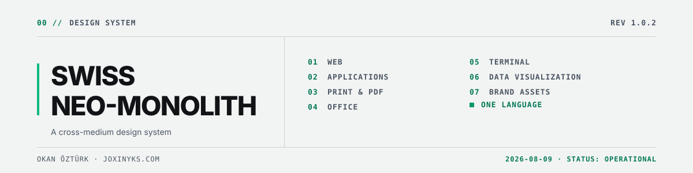
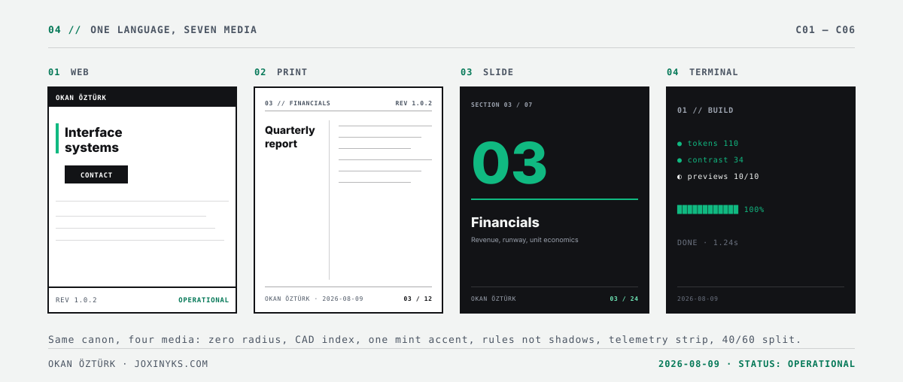
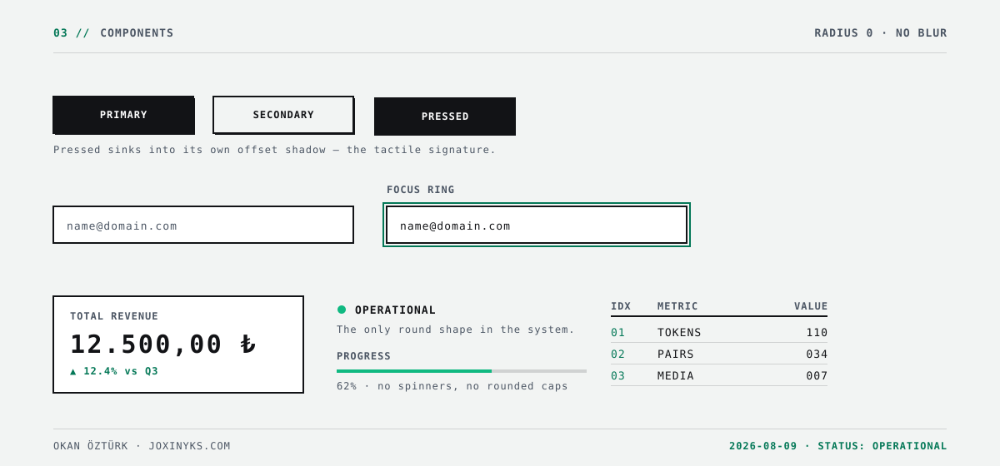
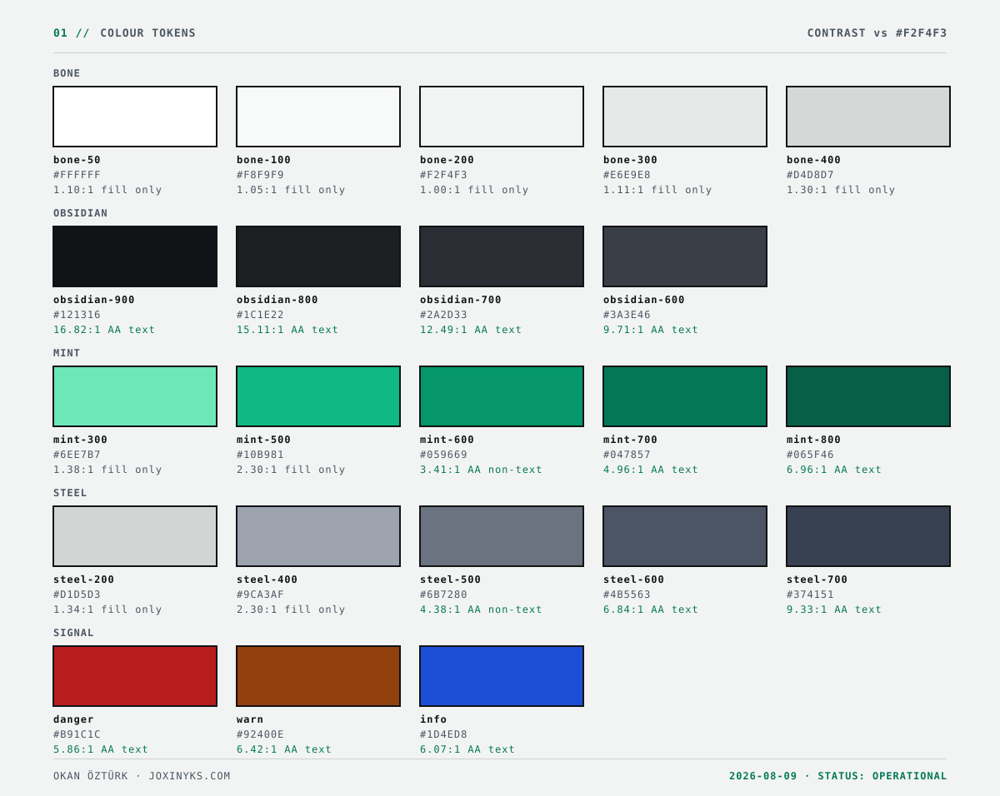
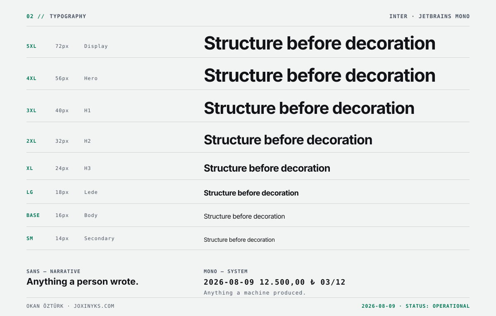

<picture>
  <source media="(prefers-color-scheme: dark)" srcset=".github/preview/banner-dark.svg">
  
</picture>

[](https://github.com/joxinyks/swiss-neo-monolith/actions/workflows/verify.yml)


One design language, from a web interface to a printed proposal, from a desktop
application to a terminal report. A component, a cover page and a command-line
summary read as the work of one hand.

This repository is two things at once:

| | |
|---|---|
| **A design system** | Tokens, rules, reference implementations and audit tooling. |
| **A Claude skill** | On any machine where it is installed, Claude applies the system automatically. |

---

## 01 // SEE IT

Every image below is **generated from the tokens** by `scripts/build-previews.mjs`.
Change a token, rerun, and the showcase follows. It cannot drift from the system
it documents — and the contrast figures are computed live, not typed.

### One language, seven media

The same canon rendered as a web page, a print page, a slide and a terminal.

<picture>
  <source media="(prefers-color-scheme: dark)" srcset=".github/preview/media-dark.svg">
  
</picture>

### Components

Zero radius, hard-offset shadows, the tactile press state, and the one round shape
the system permits.

<picture>
  <source media="(prefers-color-scheme: dark)" srcset=".github/preview/components-dark.svg">
  
</picture>

### Colour

Each swatch states its own contrast ratio against the sheet background, and
whether that permits text, non-text, or fill only.

<picture>
  <source media="(prefers-color-scheme: dark)" srcset=".github/preview/palette-dark.svg">
  
</picture>

### Typography

Two families with one hard rule: anything a machine produced is monospace,
anything a person wrote is sans.

<picture>
  <source media="(prefers-color-scheme: dark)" srcset=".github/preview/type-dark.svg">
  
</picture>

---

## 02 // INSTALL

```bash
git clone https://github.com/joxinyks/swiss-neo-monolith.git
cd swiss-neo-monolith
```

**Windows**

```powershell
.\install.ps1
```

**macOS · Linux**

```bash
chmod +x install.sh && ./install.sh
```

The script places `skills/swiss-neo-monolith` under `~/.claude/skills/`, compiles
the token bindings and runs the contrast gate. Restart Claude and the skill is
active in every project.

### Development machine

On the machine where the system itself is edited, link instead of copying so
changes take effect without reinstalling.

```powershell
.\install.ps1 -Link
```

```bash
./install.sh --link
```

### Updating

```bash
git pull && .\install.ps1 -Force
```

### Verifying

```bash
npm run verify
```

Anything other than `PASS` means the installation is incomplete or broken.

---

## 03 // THE CANON

Six invariants, independent of medium. Whether an output belongs to this system is
decided here.

| Code | Rule |
|---|---|
| `C01` | **Zero radius.** No rounded corners; the only exception is the status pulse dot. |
| `C02` | **CAD indexing.** Every section opens with a two-digit monospace tag: `01 // SECTION`. |
| `C03` | **One chromatic accent.** No colour but mint; mint stays under 10% of visible area. |
| `C04` | **Structure is drawn with rules.** Crisp rules instead of blurred shadows, gradients and texture. |
| `C05` | **Telemetry colophon.** Every output carries revision, ISO date and status. |
| `C06` | **Asymmetry.** A 40/60 split by default; nothing is centred. |

Full detail: [`SKILL.md`](skills/swiss-neo-monolith/SKILL.md)

---

## 04 // COVERAGE

| Medium | Reference |
|---|---|
| Web — React, Tailwind, HTML | [`10-web.md`](skills/swiss-neo-monolith/references/10-web.md) |
| Applications — desktop and mobile | [`11-app.md`](skills/swiss-neo-monolith/references/11-app.md) |
| Print and PDF | [`12-print.md`](skills/swiss-neo-monolith/references/12-print.md) |
| Office — PPTX, DOCX, XLSX | [`13-office.md`](skills/swiss-neo-monolith/references/13-office.md) |
| Terminal and CLI | [`14-terminal.md`](skills/swiss-neo-monolith/references/14-terminal.md) |
| Data visualisation | [`15-data-viz.md`](skills/swiss-neo-monolith/references/15-data-viz.md) |
| Brand assets | [`16-brand-assets.md`](skills/swiss-neo-monolith/references/16-brand-assets.md) |

The base layer applies to all of them:
[colour and scale](skills/swiss-neo-monolith/references/01-foundations.md) ·
[typography](skills/swiss-neo-monolith/references/02-typography.md) ·
[motion and sound](skills/swiss-neo-monolith/references/03-motion-sound.md) ·
[voice and format](skills/swiss-neo-monolith/references/04-voice.md) ·
[delivery checklist](skills/swiss-neo-monolith/references/99-checklist.md)

---

## 05 // TOKEN PIPELINE

`tokens/tokens.json` is the only file edited by hand. Every binding is generated
from it; nothing under `dist/` is edited directly.

```
tokens.json
    |
    +-- build-tokens.mjs
    |       +-- tokens.css              CSS custom properties, light and dark
    |       +-- tokens.scss
    |       +-- tokens.ts               typed access, literal values
    |       +-- tailwind.preset.cjs     catches off-palette values at build time
    |       +-- tokens.py               ReportLab · WeasyPrint · matplotlib
    |       +-- tokens.dart             Flutter
    |       +-- tokens.resolved.json    Office · email · native platforms
    |
    +-- build-previews.mjs  -->  .github/preview/*.svg   (this README's showcase)
    |
    +-- check-contrast.mjs  -->  WCAG gate, exits non-zero on failure
```

### Changing a token

```bash
# 1  edit tokens/tokens.json
# 2  regenerate bindings and showcase
npm run build

# 3  pass the contrast gate
npm run check

# 4  raise $meta.version, record it in CHANGELOG.md
```

The gate audits 34 foreground/background pairs against WCAG thresholds in both
themes. It also holds guard tests over tones that are banned for text, so a future
palette edit cannot quietly make them look safe.

---

## 06 // USING IT

**Web**

```js
// tailwind.config.js
module.exports = {
  presets: [require('./vendor/snm/tailwind.preset.cjs')],
};
```

```css
@import 'vendor/snm/tokens.css';
```

**Python — PDF and charts**

```python
from snm.tokens import token, rgb

fill = rgb("accent")           # (0.06, 0.73, 0.51)
text = token("text", "dark")   # "#f2f4f3"
```

**Flutter**

```dart
import 'snm/tokens.dart';

Container(color: SnmLight.bgRaised, ...)
```

**TypeScript — canvas, SVG, email**

```ts
import { token, cssVar } from '@snm/tokens';

ctx.fillStyle = token('bgInverse');      // literal, theme selectable
el.style.color = cssVar('textAccent');   // var(--snm-text-accent)
```

---

## 07 // LAYOUT

```
swiss-neo-monolith/
├─ install.ps1 · install.sh          installers
├─ .github/preview/                  generated showcase — do not edit
└─ skills/swiss-neo-monolith/        the installed unit, self-contained
   ├─ SKILL.md                       canon and routing
   ├─ references/                    12 medium and base-layer references
   ├─ tokens/
   │  ├─ tokens.json                 single source of truth
   │  └─ dist/                       generated bindings
   ├─ assets/
   │  ├─ web/                        FooterGlobal · useMechanicalClick · eslint
   │  ├─ print/                      CSS Paged Media stylesheet
   │  └─ office/                     OOXML theme scheme
   └─ scripts/
      ├─ lib/color.mjs               shared WCAG maths
      ├─ build-tokens.mjs
      ├─ build-previews.mjs
      └─ check-contrast.mjs
```

---

## 08 // VERSIONING

`MAJOR` a visual break — existing outputs must be regenerated ·
`MINOR` a new token, rule or medium · `PATCH` a fix or clarification.

Every change is recorded in [`CHANGELOG.md`](CHANGELOG.md). See
[`CONTRIBUTING.md`](CONTRIBUTING.md) for the working rules. Nothing merges without
passing the contrast gate.

---

```
OKAN ÖZTÜRK · joxinyks.com
REV 1.0.2 · STATUS: OPERATIONAL · LICENCE: MIT
```
